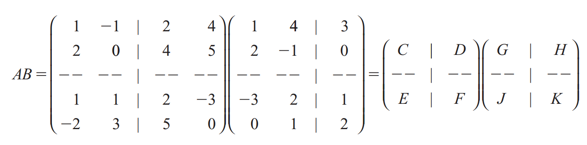
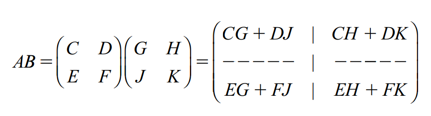

# Producto por bloques

Tambien es posible realizar la multiplicacion de matrices distribuyendo el trabajo por bloques, es decir partiendo nuestra matriz en  bloques, respetando que sea compatibles la mu

ltiplicacion de los bloques entre si, es decir, que $A$ dada por $m \times x$ y $B$ dada por $n \times p$, entonces $x = n$ 

Una vez que tengamos indetificado cada blque, podemos indetificarlo como nuevas matrices y asi poder una hace multiplicacion sencilla, como hicismos en un principio.

## Ejemplo:

Considere al producto:

$$
AB = \begin{bmatrix}
1 & -1 & 2 & 4 \\
2 & 0 & 4 & 5 \\
1 & 1 & 2 & -3\\
-2 & 3 & 5 & 0\\
\end{bmatrix} 
\begin{bmatrix}
1 & 4 & 3 \\
2 & -1 & 0 \\
-3 & 2 & 1 \\
0 & 1 & 2 \\
\end{bmatrix}\ \\
$$
Quedando de esta forma
$$
C = \begin{bmatrix}
1 & -1 \\
2 & 0 \\
\end{bmatrix} \ D=\begin{bmatrix}
2 & 4 \\
4 & 5 \\
\end{bmatrix}\\
E=\begin{bmatrix}
1 & 1 \\
-2 & 3 \\
\end{bmatrix} \ F=\begin{bmatrix}
2 & -3 \\
5 & 0 \\
\end{bmatrix}
$$

$$
G = \begin{bmatrix}
1 & 4 \\
2 & -1 \\
\end{bmatrix} \ H=\begin{bmatrix}
3 \\
0 \\
\end{bmatrix}\\
J=\begin{bmatrix}
-3 & 2 \\
0 & 1 \\
\end{bmatrix} \ K=\begin{bmatrix}
1 \\
2 \\
\end{bmatrix}
$$

Y así podríamos hacer sucesivamente
$$
AB = \begin{bmatrix}
C & D \\
E & F \\
\end{bmatrix} \ \begin{bmatrix}
G & H \\
J & K \\
\end{bmatrix} = \begin{bmatrix}
CG +DJ \\
EG + FJ \\
\end{bmatrix}\begin{bmatrix}
CH + DK \\
EH + FK \\
\end{bmatrix}
$$
Cuando se hace una partición de dos matrices y todos los productos de submatrices están definidos se dice que la partición es conformante.
